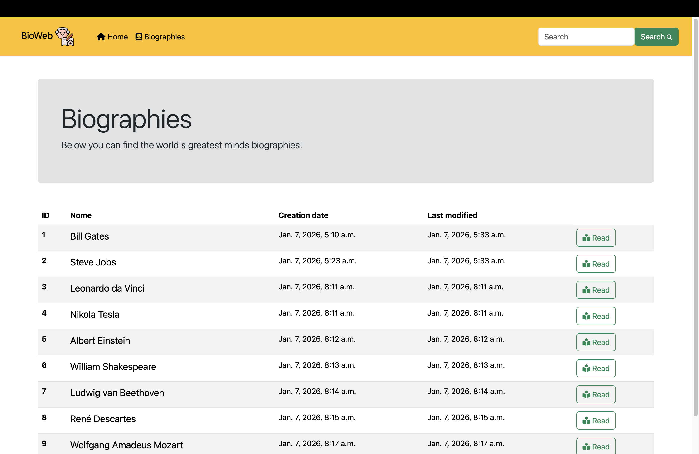
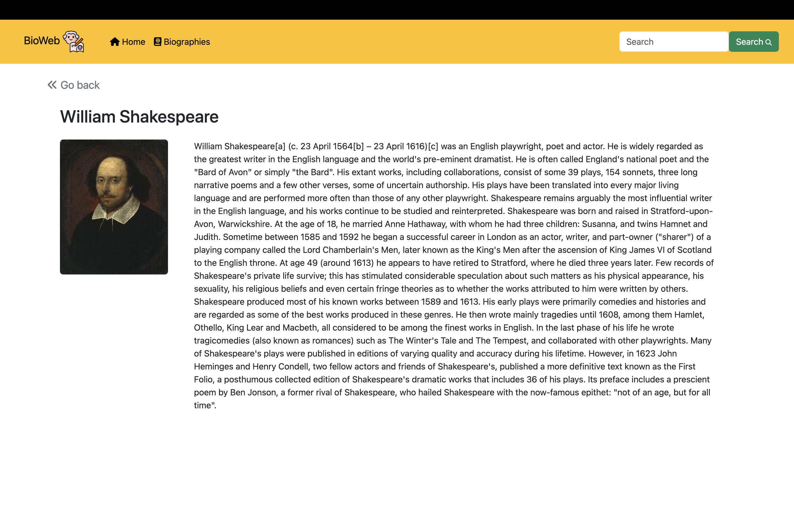

🧠 Biographies — Great Minds of the World

A Django web application inspired by an educational tutorial, built to showcase biographies of some of the world’s greatest minds — thinkers, innovators, scientists, and influential figures who shaped human knowledge and history.

This project was developed as a learning-based implementation, with personal modifications of the original tutorial.

### ✨ Features
- 📖 Browse biographies of influential historical figures
- 🔍 Search biographies by name
- 🧭 Simple navigation with reusable templates
- 🗂️ Django app structure following best practices
- 🎨 HTML templates with a shared base layout

### 🛠️ Tech Stack
- Python 3
- Django
- SQLite (development database)
- HTML / Django Templates
- CSS (static files)

### 🖼️ Screenshots



### Getting Started
```
git clone git@github.com:RafaelaYazawa/BioWeb.git
cd BioWeb
python -m venv .venv
source .venv/bin/activate
pip install django
python manage.py migrate
python manage.py runserver

```

### 👩‍💻 Author
Rafaela Yazawa